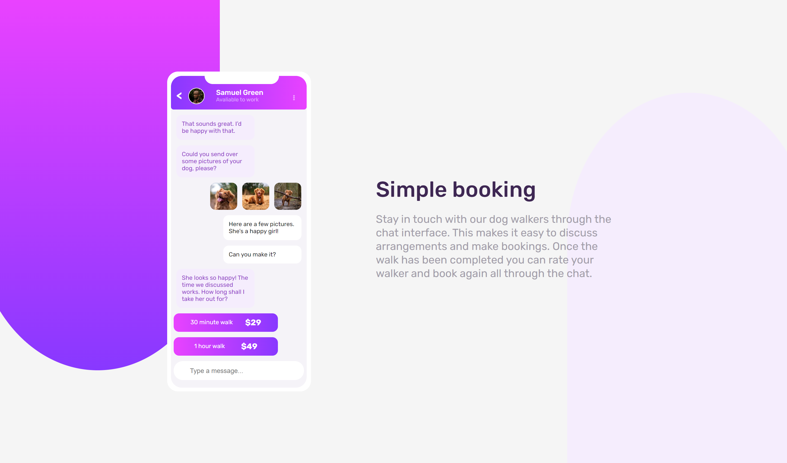

# Frontend Mentor - Chat app CSS illustration solution

This is a solution to the [Chat app CSS illustration challenge on Frontend Mentor](https://www.frontendmentor.io/challenges/chat-app-css-illustration-O5auMkFqY). Frontend Mentor challenges help you improve your coding skills by building realistic projects. 

## Overview

### Screenshot

### Links

- Solution URL: [Repository](https://github.com/Crisleoco2004/chat-app-css)
- Live Site URL: [GH Pages](https://crisleoco2004.github.io/chat-app-css/)

## My process

### Built with

- Semantic HTML5 markup
- CSS custom properties
- Flexbox
- CSS Grid
- Mobile-first workflow
- Gulp
- SASS
- PUG

## Author

- [Website](https://crisleoco2004.github.io/)
- [Frontend Mentor](https://www.frontendmentor.io/profile/Crisleoco2004)
- [Twitter](https://www.twitter.com/crisleooc)
